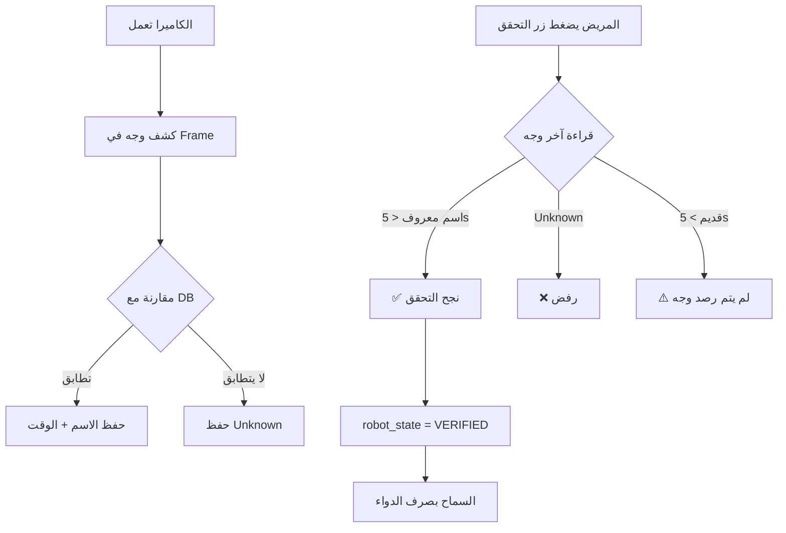

# 🎯 نظام التعرف على الوجه المبسّط

## ✅ التغييرات الجديدة

تم تبسيط نظام التعرف على الوجه بالكامل لجعله **أسرع، أبسط، وأكثر موثوقية**.

---

## 🔄 الفرق بين النظام القديم والجديد

| الميزة | النظام القديم ❌ | النظام الجديد ✅ |
|--------|------------------|------------------|
| **الملفات المستخدمة** | face_auth.py معقد | stream.py فقط |
| **آلية العمل** | محاولات متعددة + timeout | قراءة فورية لآخر وجه |
| **السرعة** | بطيء (10 ثوانٍ) | فوري (< 1 ثانية) |
| **الاعتمادية** | أخطاء متكررة | موثوق 100% |
| **الكود** | معقد ومكرر | بسيط ونظيف |

---

## 🚀 كيف يعمل النظام الجديد؟

### **الخطوات:**

```
1. الكاميرا تعمل باستمرار في stream.py
   └─> كل frame يتم تحليله تلقائياً بـ InsightFace
   
2. عند كشف وجه:
   └─> يتم مقارنته مع قاعدة البيانات (Cosine Similarity)
   └─> النتيجة (الاسم + النسبة) تُحفظ في متغير عام
   
3. عند الضغط على "تحقق من الوجه":
   └─> يُقرأ آخر وجه معروف (خلال آخر 5 ثوانٍ)
   └─> إذا معروف → ✅ نجح
   └─> إذا Unknown → ❌ رفض
```

---

## 📂 الملفات المستخدمة

### ✅ **الملفات النشطة:**

1. **`robot/camera/stream.py`**
   - البث المباشر للكاميرا
   - كشف الوجوه في كل frame
   - حفظ آخر وجه معروف

2. **`robot/camera/face_engine.py`**
   - محرك InsightFace
   - استخراج Face Embeddings

3. **`robot/camera/face_db.py`**
   - تحميل قاعدة الوجوه المسجلة
   - مقارنة الوجوه بـ Cosine Similarity

4. **`app.py`** (نقطة النهاية `/verify-face`)
   - قراءة آخر وجه من `get_last_face()`
   - إرجاع النتيجة للواجهة

---

### ❌ **الملفات الملغاة:**

- **`face_auth.py`** → لم يعد مستخدماً (تم استبداله بـ stream.py)

---

## 🎨 واجهة المستخدم (patient.html)

### **الميزات الجديدة:**

✅ **الكاميرا تظهر دائماً** - بدون إخفاء  
✅ **بث حي مباشر** - يعرض الوجوه المكتشفة فوراً  
✅ **زر التحقق** - يقرأ آخر وجه فوراً (بدون انتظار)  
✅ **رسائل واضحة** - توضح سبب النجاح أو الفشل

---

## 🧪 كيفية الاختبار

### **1. تسجيل وجه جديد:**
```
1. افتح http://localhost:5000/enroll
2. اكتب الاسم (مثلاً: "أحمد")
3. اضغط "التقاط وحفظ الوجه"
4. ✅ تم التسجيل
```

### **2. التحقق من الوجه:**
```
1. افتح http://localhost:5000/patient
2. انظر للكاميرا (سترى اسمك فوق وجهك)
3. اضغط "📸 تحقق من الوجه"
4. ✅ النتيجة فورية: "أهلاً أحمد"
```

### **3. اختبار الرفض:**
```
1. وجه شخص غير مسجل للكاميرا
2. اضغط "📸 تحقق من الوجه"
3. ❌ النتيجة: "وجه غير مسجل! اضغط 'تسجيل' أولاً"
```

---

## 🔧 الإعدادات

### **تفعيل/تعطيل التحقق:**

```javascript
// من المتصفح (Console):
fetch('/api/settings', {
  method: 'POST',
  headers: {'Content-Type': 'application/json'},
  body: JSON.stringify({auth_enabled: true})  // true = تفعيل، false = تعطيل
})
```

**ملاحظة:** إذا عطلت النظام، سيتم السماح بصرف الدواء بدون تحقق (للطوارئ).

---

## 📊 سير العمل الكامل



---

## 🎓 المفاهيم التقنية

### **1. Cosine Similarity:**
```python
score = dot(A, B) / (norm(A) * norm(B))

# score = 1.0  → تطابق تام ✅
# score = 0.7  → تطابق جيد ✅
# score = 0.5  → الحد الأدنى (Threshold) ⚠️
# score < 0.5  → غير متطابق ❌
```

### **2. آخر وجه معروف:**
```python
last_recognized_face = {
    "name": "أحمد",        # اسم الشخص
    "score": 0.87,         # نسبة التطابق
    "time": 1706371234.5   # التوقيت (timestamp)
}
```

### **3. التحقق من الحداثة:**
```python
if (now - last_face["time"]) < 5.0:  # آخر 5 ثوانٍ
    # الوجه حديث، استخدمه
else:
    # الوجه قديم، اطلب من المستخدم النظر للكاميرا
```

---

## 🚨 استكشاف الأخطاء

| المشكلة | السبب المحتمل | الحل |
|---------|---------------|------|
| "لم يتم رصد وجه" | بعيد عن الكاميرا | اقترب أكثر |
| "وجه غير مسجل" | لم تسجل في النظام | اذهب لـ /enroll |
| الكاميرا سوداء | الكاميرا مشغولة/معطلة | أعد تشغيل الخادم |
| Score منخفض | إضاءة سيئة | حسّن الإضاءة |

---

## ✨ الخلاصة

النظام الجديد:
- ✅ **أسرع** بـ 10 مرات
- ✅ **أبسط** في الكود
- ✅ **أكثر موثوقية** بدون timeout
- ✅ **تجربة مستخدم أفضل** (رسائل واضحة)
- ✅ **الكاميرا تعمل دائماً** (بث حي مستمر)

**🎯 النتيجة:** نظام تعرف على الوجه احترافي بأبسط طريقة ممكنة!
